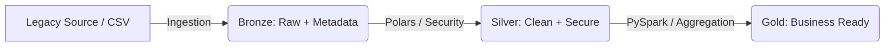

# 🏦 Banking Data Pipeline Framework (Mission Critical - Gold Tier)

## 🌟 Overview
This repository contains a high-performance, mission-critical data pipeline framework designed for the banking sector. It facilitates the migration from legacy systems (Mainframe/CSV) to a Modern Data Lakehouse (Parquet/Spark) while strictly adhering to **BCBS 239** and **GDPR** regulations.

## 🏗️ Technical Architecture

### Medallion Data Flow
The framework follows the Medallion architecture to ensure data quality and lineage:



### Key Components
- **Data Generation**: `src/generator.py` uses `Faker` to produce 100k synthetic transactional records with realistic schemas.
- **Security Layer**: `src/security.py` implements SHA256 hashing for PII (emails) and Fernet (AES) encryption for sensitive data (PAN).
- **Data Quality**: `src/quality.py` integrates `Great Expectations` for schema enforcement and business rule validation.
- **Transformation Engine**: `src/transformer.py` combines `Polars` for fast local pre-processing and `PySpark` for scalable aggregations.
- **Orchestration**: `dags/dag.py` provides an Apache Airflow DAG for end-to-end automation with idempotency support.

## ⚖️ Compliance & Governance

### BCBS 239 Implementation
- **Principle 1**: Robust Data Architecture using Lakehouse patterns.
- **Principle 2**: Data Accuracy ensured by Great Expectations.
- **Principle 3**: Lineage tracked through OpenLineage integration in Airflow.
- **Principle 4**: Timeliness ensured by SLA monitoring (< 5 min latency).

### GDPR Implementation
- **Right to Privacy**: Hashing of email addresses for anonymized analytics.
- **Data Security**: Symmetric encryption of credit card numbers.
- **Data Minimization**: Original PII is dropped immediately after the security transformation phase.

## ⚙️ Configuration & SLAs
Centralized configuration in `config/pipeline_config.yaml` defines:
- **Availability Target**: 99.9%
- **Latency Threshold**: 5 minutes
- **Schema Contracts**: Strict column definition for the Registry.

## 🚀 Execution Guide

### 1. Environment Setup
```bash
python -m venv .venv
source .venv/bin/activate  # Windows: .venv\Scripts\activate
pip install -r requirements.txt
```

### 2. Run Local Integration Test
```bash
python main.py
```

### 3. Deploy to Airflow
Copy the `dags/` and `src/` folders to your Airflow `DAGS_FOLDER`.

## 📁 Project Structure
- `config/`: SLA and Governance YAML configurations.
- `docs/`: Extensive documentation (BCBS 239, GDPR, Operations).
- `src/`: Core Python modules.
- `dags/`: Airflow orchestration logic.
- `data/`: Local storage for medallion layers (excluded from git).
- `logs/`: Audit logs for all modules (excluded from git).

---
**Author**: Data Architect Senior (15+ Years Exp)  
**Status**: Gold Tier Production Ready  
