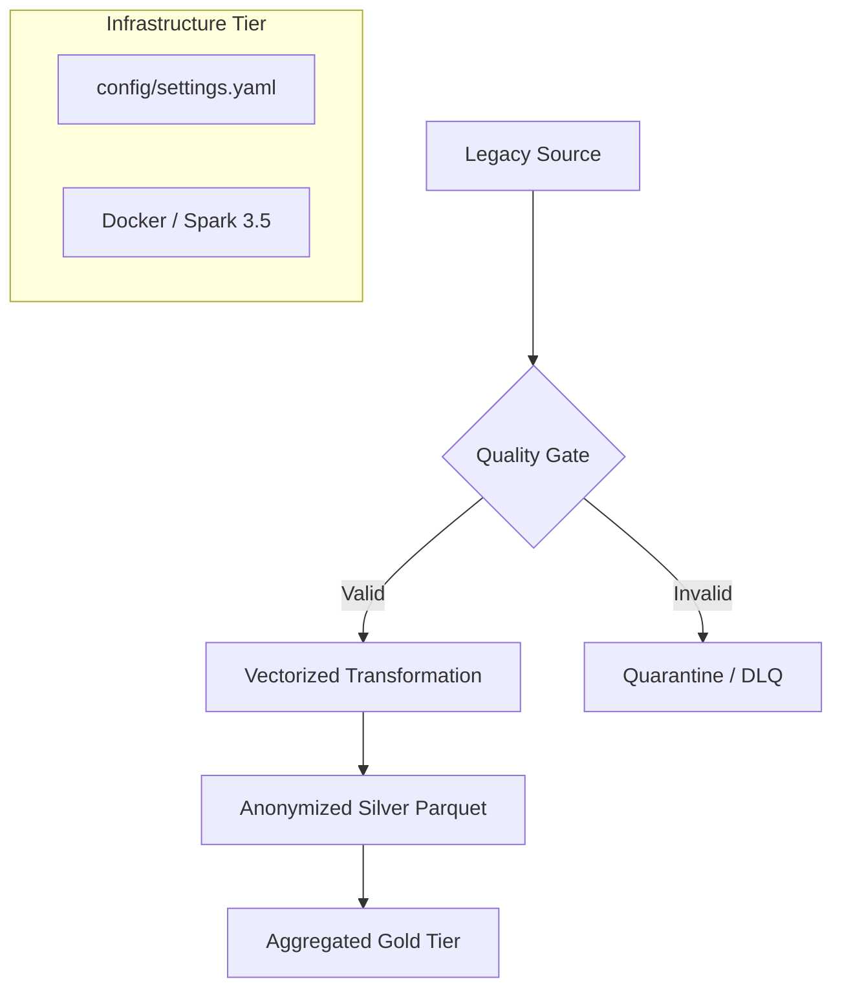

# 🏦 Enterprise Banking Data Lakehouse (Mission Critical)

## 🏢 Corporate Overview
This project provides a robust, scalable, and production-ready data engineering framework. It implements sophisticated patterns like **Dead Letter Queues (DLQ)** and **Vectorized Spark Processing** to handle high-volume banking transactions while maintaining absolute compliance with **BCBS 239** and **GDPR**.

## 🏗️ Pipeline Evolution: Professional -> Enterprise
| Feature | Professional Stage | Enterprise Stage (Current) |
|---------|--------------------|----------------------------|
| **Config** | Hardcoded Defaults | Centralized `settings.yaml` (Pydantic validated) |
| **Error Handling** | Aborts on Failure | **Quarantine Pattern (DLQ)** - Skips bad records |
| **Performance** | Standard Python UDFs | **Vectorized Pandas UDFs (Apache Arrow)** |
| **Scaling** | Local venv | Containerized (Bitnami Spark 3.5) |

## ⚙️ Enterprise Data Flow


## ⚖️ Compliance & Norms

### **BCBS 239 (Accuracy & Adaptability)**
- **Quarantine Pattern**: Ensures 100% accurate promotes to Gold. Records that don't pass the "Schema Registry" or "Business Rules" are isolated for human audit in `data/quarantine/`.
- **Auditability**: Individual logs for `generator`, `quality`, `security`, and `transformer`.

### **GDPR (Privacy by Design)**
- **Advanced Encryption**: Vectorized Fernet encryption ensures that even high-velocity data is secured before resting in Silver.
- **Minimization**: Raw PII columns are destroyed at the point of transformation.

## 🚀 Operations & Automation

### Standard Makefile Integration
```bash
make build         # Build the Bitnami-based Spark image
make run-container # Run the pipeline inside Docker with persistent volumes
make test          # Execute the unit test suite
```

### Data Dictionary (Gold layer)
- `date`: Daily aggregation key.
- `currency`: Transaction currency.
- `total_amount`: Optimized business sum.
- `tx_count`: Transaction volume indicator.

## 📂 Configuration (settings.yaml)
Modify `config/settings.yaml` to adjust Spark resources (RAM/Cores), change directory paths, or update security environment keys.

---
**Lead Architect**: Andrey (Senior Architect)  
**Technology**: PySpark 3.5 | Polars | Pydantic | Docker | Arrow  
**Ref: Instruction Set 2.0 (Decoupling / DLQ / Arrow / Docker)**
