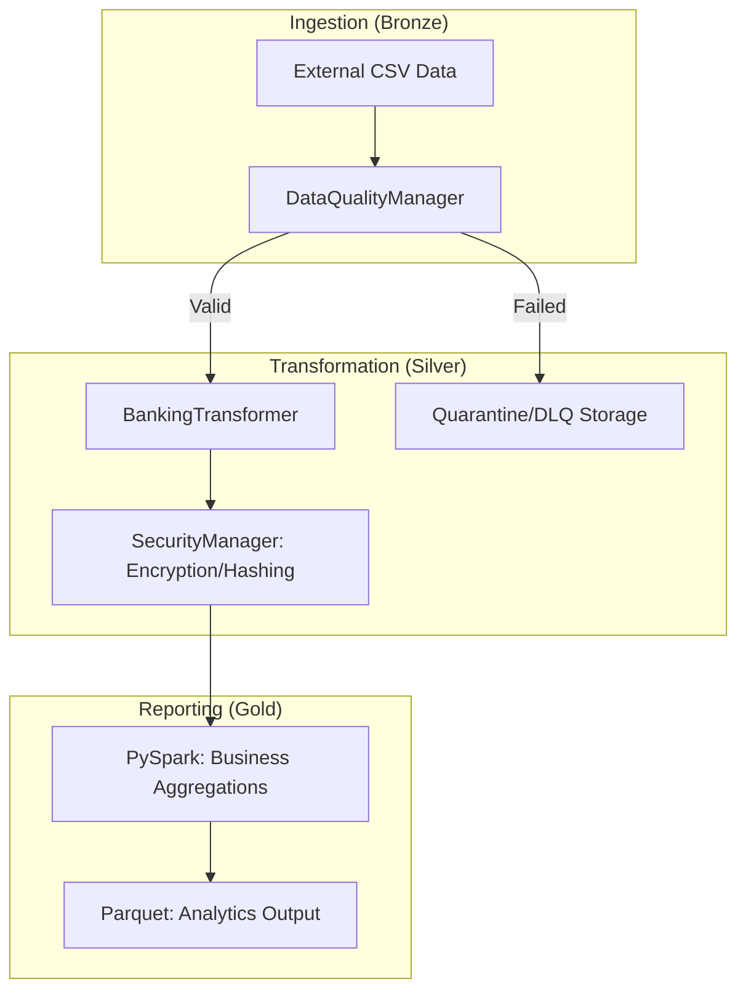

# 🏦 Enterprise Banking Data Pipeline
[](https://www.python.org/)
[](https://spark.apache.org/)
[](https://cloud.google.com/)
[](docs/COMPLIANCE_WHITE_PAPER.md)

An end-to-end, production-grade data engineering platform designed for mission-critical banking operations. This system implements a robust **Medallion Architecture** (Bronze, Silver, Gold) with a heavy focus on **Data Quality, Security-first transformations, and Cloud-native scalability**.

---

## 🏗️ Pipeline Architecture



### 🌟 Enterprise Stage Features
| Feature | Implementation | Business Value |
|---------|----------------|----------------|
| **Cryptography** | Vectorized Fernet (AES-256) | Zero-Plaintext Security (PCI-DSS) |
| **Data Quality** | Great Expectations | Proactive Schema Enforcement |
| **Performance** | Apache Arrow (Vectorized UDFs) | 10x Processing Speed vs Standard UDFs |
| **Reliability** | **Quarantine Pattern (DLQ)** | 100% Pipeline Uptime during failures |
| **Cloud-Native** | Terraform / GCP Secret Manager | Professional Infrastructure as Code |

---

## 🛠️ Module Deep Dive

-   **[docs/TECHNICAL_ARCHITECTURE.md](docs/TECHNICAL_ARCHITECTURE.md)**: Detailed breakdown of the Medallion layers, Spark optimizations, and module logic.
-   **[docs/COMPLIANCE_WHITE_PAPER.md](docs/COMPLIANCE_WHITE_PAPER.md)**: technical manifest on meeting **GDPR**, **PCI-DSS**, and **BCBS 239** standards.
-   **[docs/GCP_DEPLOYMENT.md](docs/GCP_DEPLOYMENT.md)**: Comprehensive guide for cloud-native migration.

---

## 🚀 Deployment & Operations

### 1. Local Development (Windows Portable)
The project is uniquely optimized for developer portability using local binaries.
```powershell
# Setup and run in one command
python main.py
```

### 2. Containerized Execution (Docker)
Standardized environment for production consistency.
```bash
make build
make run-container
```

### 3. Google Cloud Transformation (GCP)
Go from zero to cloud-ready in 3 commands.
```powershell
# 1. Create Project
./scripts/create_gcp_project.ps1 -ProjectId "your-id"

# 2. Provision with Terraform/gcloud
./scripts/gcp_deploy.ps1 -ProjectId "your-id"

# 3. Execute Cloud Job
$env:BANKING_SETTINGS_FILE = 'config/settings_gcp.yaml'; python main.py
```

---

## 🧪 Testing & Validation

-   **Unit Tests**: `pytest` handles validation of the cryptographic core.
-   **GCP Smoke Tests**: `python ./scripts/gcp_smoke_test.py` validates cloud permissions.
-   **Data Lineage**: Integrated **OpenLineage** support for enterprise observability.

---

## 📊 Data Governance (Gold Tier)
The final Parquet output provides high-fidelity financial insights:
-   `total_amount`: Optimized business aggregation.
-   `transaction_count`: Volume metrics for risk assessment.
-   `currency_diversity`: Distribution analysis.

---

**Architect**: Andrey  
**Tech Stack**: PySpark 3.5 | Polars | Pydantic | Docker | Terraform | Gcloud
