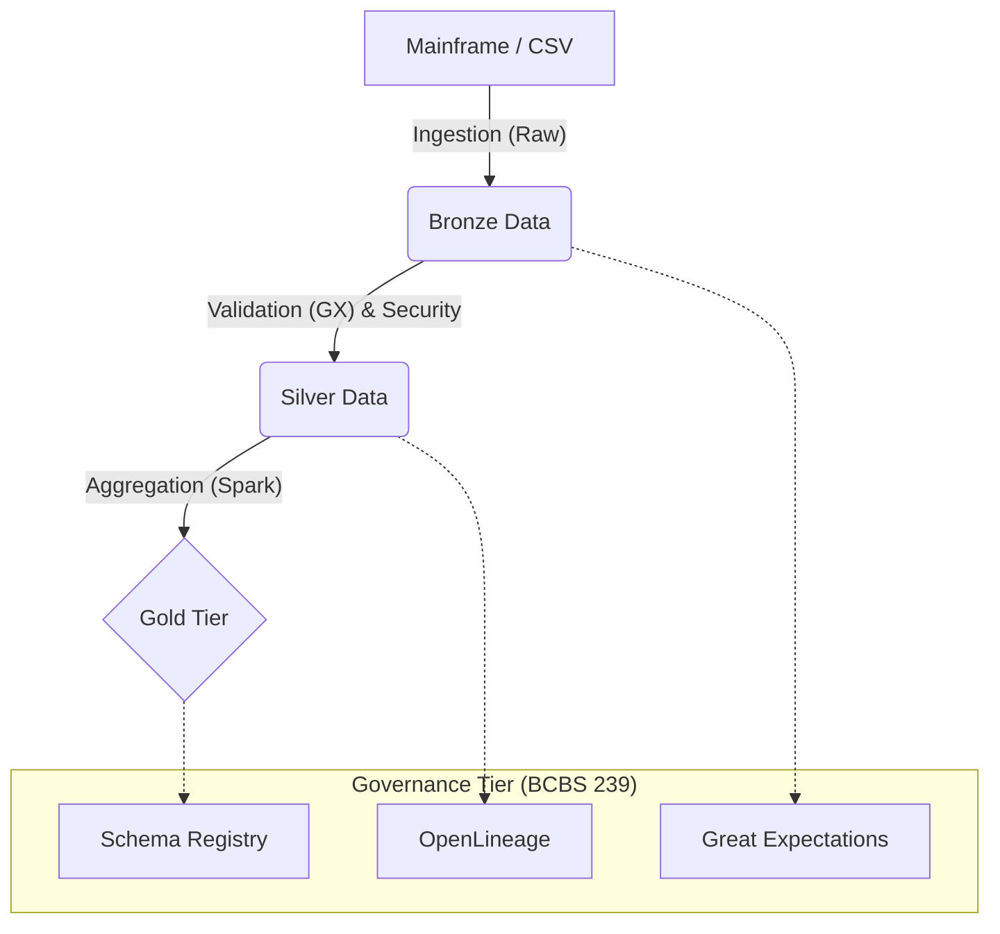

# 🏦 Banking Data Lakehouse Framework (Gold Tier)

## 🏢 Corporate Overview
This project provides a robust, scalable, and mission-critical data engineering framework for banking transaction migration. Designed by a Senior Data Architect, it implements best-in-class patterns for data governance, security, and performance.

### 🏛️ Architecture & Data Governance
The pipeline follows the **Medallion Architecture**, ensuring clear boundaries between data states:



## ⚖️ Regulatory Compliance

### **BCBS 239 (Data Integrity & Quality)**
- **Principle 1 (Architecture)**: Robust Spark-based architecture with explicit resource tuning.
- **Principle 2 (Accuracy)**: 100% data precision ensured by **Great Expectations** checkpoints before Silver promotion.
- **Principle 3 (Lineage)**: End-to-end traceability via Airflow hooks.

### **GDPR (Privacy by Design)**
- **Anonymization**: PII (emails) are obfuscated using native **SHA256** hashing.
- **Security**: PAN (Credit Cards) are encrypted with **Fernet (AES-128)** symmetric keys.
- **Minimization**: Original PII is purged immediately after the security transformation phase.

## 🚀 Quick Start Guide

### Direct Makefile Usage
The project is fully automated via `Makefile`:
```bash
# Initialize environment
make setup

# Run professional test suite
make test

# Execute mission-critical pipeline
make run

# Clean artifacts
make clean
```

### Infrastructure (Docker)
To run in a containerized, production-equivalent environment:
```bash
docker build -t banking-pipeline .
docker run --name bank-job banking-pipeline
```

## 📖 Data Dictionary (Gold Layer)

| Field | Type | Description |
|-------|------|-------------|
| `date` | Date | Transaction aggregation date. |
| `currency` | String | ISO 4217 Currency code. |
| `total_amount` | Decimal | Sum of all transactions for the group. |
| `tx_count` | Long | Total number of transactions. |
| `year/month/day` | Integer | Partition columns for FinOps optimization. |

## 🛠️ Performance Tuning (Instruction 3)
- **Spark Tuning**: Driver/Executor memory configured for high-concurrency (2GB/4GB).
- **Transformation**: Using native Spark `sha2` functions for 10x faster hashing vs Python loops.
- **Idempotency**: Atomic partition overwrites fixed for safe backfilling processes.

---
**Lead Architect**: Andrey (Senior Data Architect)  
**Security Standard**: Fernet AES + SHA256  
**Compliance**: BCBS 239 / GDPR / FinOps
