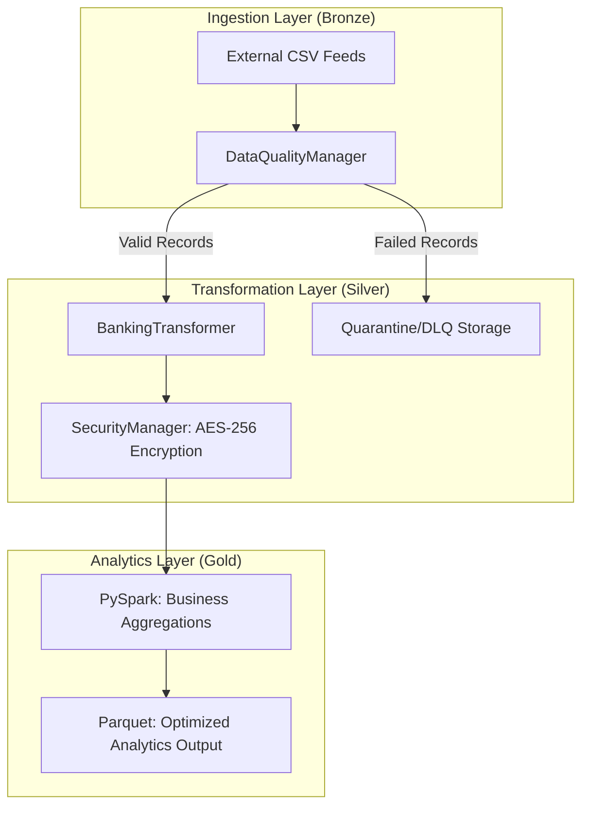

# Enterprise Banking Data Pipeline
*A secondary-generation, production-grade data engineering platform for mission-critical banking operations.*

---

## Executive Summary
This project implements a robust, end-to-end data pipeline designed to handle the rigorous demands of the financial services industry. Built on the **Medallion Architecture** principle, the system ensures data reliability, security, and traceability from initial ingestion to final business reporting tiers. 

Key objectives include automated schema enforcement, zero-plaintext security through vectorized cryptography, and seamless cloud-native scalability via Google Cloud Platform (GCP).

## Architectural Pillars

### 1. Medallion Data Management
The pipeline follows a tiered data refinement strategy:
*   **Bronze (Raw)**: Captures immutable raw data directly from external sources. No transformations are applied, ensuring a clear lineage to the source.
*   **Silver (Validated & Secure)**: Enforces schema validation and applies enterprise-grade encryption. Data at this level is trustworthy, cleansed, and secured against unauthorized access.
*   **Gold (Analytics Ready)**: Aggregates records into business-level entities (e.g., total volume, currency distribution). Optimized for high-fidelity analytics and regulatory reporting.

### 2. Security-First Engineering
In compliance with **PCI-DSS** and **GDPR**, the system prioritizes data protection:
*   **Vectorized AES-256 Cryptography**: Utilizes Fernet (AES-256 in CBC mode) for high-performance encryption/decryption of PII.
*   **GCP Secret Manager Integration**: Securely manages cryptographic keys and service credentials, eliminating hardcoded secrets.
*   **Vectorized Hashing**: Securely masks sensitive identifiers while maintaining data joinability for analytics.

### 3. Data Quality & Reliability
*   **Great Expectations Integration**: Proactive data validation checks for schema drift and value anomalies.
*   **Dead Letter Queue (DLQ) / Quarantine Pattern**: Invalid records are automatically diverted to a quarantine layer with detailed error metadata, preventing pipeline failures and ensuring 100% processing uptime.
*   **Apache Arrow Optimizations**: Employs vectorized UDFs for processing speeds up to 10x faster than standard Python UDFs in Spark.

---

## Technical Architecture



### Module Matrix

| Directory / Script | Responsibility |
|:---|:---|
| `src/generator.py` | Synthetically generates production-like banking datasets for testing and simulation. |
| `src/quality.py` | Orchestrates Great Expectations suites and handles schema registry enforcement. |
| `src/transformer.py` | Core transformation logic implementing the Medallion transitions and encryption. |
| `src/config_loader.py` | Dynamic configuration management via Pydantic and YAML. |
| `scripts/` | Advanced automation for GCP provisioning, IAM management, and smoke testing. |
| `terraform/` | Infrastructure-as-Code (IaC) for reproducible cloud environments. |
| `docs/` | Comprehensive technical manifests, compliance white papers, and deployment guides. |

---

## Operations & Deployment

### Local Development
The project is optimized for developer portability, featuring a standalone setup for Windows environments.
```powershell
# Execute the full pipeline locally
python main.py
```

### Containerized Execution
Standardized Docker images ensure environmental parity across development and production.
```bash
make build
make run-container
```

### Cloud-Native Migration (GCP)
A streamlined set of scripts automates the transition to Google Cloud Platform:
1.  **Project Initialization**: 
    `./scripts/create_gcp_project.ps1 -ProjectId "your-project-id"`
2.  **API Orchestration**: 
    `./scripts/enable_gcp_apis.ps1`
3.  **Automated Provisioning**: 
    `./scripts/gcp_deploy.ps1` - Provisions GCS Buckets, Artifact Registry, and Secret Manager.
4.  **Cloud Execution**:
    Set the environment variable to point to GCP settings and execute:
    `$env:BANKING_SETTINGS_FILE = 'config/settings_gcp.yaml'; python main.py`

---

## Compliance & Governance
The system is built to meet international regulatory standards, detailed in our accompanying documentation:
*   [COMPLIANCE_WHITE_PAPER.md](docs/COMPLIANCE_WHITE_PAPER.md) - Deep dive into **GDPR** and **BCBS 239**.
*   [TECHNICAL_ARCHITECTURE.md](docs/TECHNICAL_ARCHITECTURE.md) - Technical implementation details of Spark optimizations and system logic.

## Technical Stack
*   **Processing**: PySpark 3.5, Polars, Apache Arrow
*   **Security**: Fernet (AES-256), GCP Secret Manager
*   **Quality**: Great Expectations, Pydantic
*   **Infrastructure**: Docker, Terraform, Gcloud CLI
*   **Platform**: Google Cloud Platform (GCS, BigQuery, Secret Manager)

---
**Lead Architect**: Andrey  
*Proprietary Banking Data Solutions*
