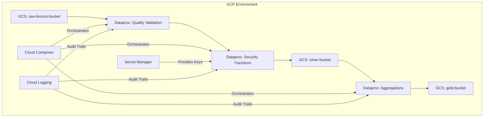

# GCP Deployment Guide - Banking Data Pipeline

This document outlines the strategy for deploying the enterprise-grade banking data pipeline to Google Cloud Platform (GCP).

## Architecture Mapping

| Local Component | GCP Service | Rationale |
|-----------------|-------------|-----------|
| Local Storage | **Cloud Storage (GCS)** | Scalable, durable object storage for Bronze, Silver, and Gold layers. |
| PySpark | **Cloud Dataproc** | Managed Spark cluster for processing and aggregations. |
| Airflow | **Cloud Composer** | Managed Airflow for reliable orchestration and OpenLineage integration. |
| `secrets.env` | **Secret Manager** | Secure storage and access control for encryption keys (GDPR/PCI-DSS compliant). |
| `logs/` | **Cloud Logging** | Centralized audit logs for compliance with BCBS 239. |

## Infrastructure Diagram



## Step-by-Step Deployment

### 1. Setup Storage (GCS)
Create the medallion buckets:
```bash
gsutil mb gs://banking-bronze-${PROJECT_ID}
gsutil mb gs://banking-silver-${PROJECT_ID}
gsutil mb gs://banking-gold-${PROJECT_ID}
gsutil mb gs://banking-quarantine-${PROJECT_ID}
```

### 2. Configure Secrets
Store your Fernet encryption key:
```bash
echo -n "your-fernet-key" | gcloud secrets create banking-encryption-key --data-file=-
```

### 3. Deploy Cloud Composer
Initialize the Airflow environment and upload the DAG:
- Upload `dags/dag.py` to the Composer `/dags` folder.
- Set environment variables in Composer:
  - `GCS_BUCKET_BRONZE`
  - `GCS_BUCKET_SILVER`
  - `GCS_BUCKET_GOLD`

### 4. Dataproc Configuration
When running Spark jobs on Dataproc, ensure the `google-cloud-secret-manager` and `cryptography` libraries are included as initialization actions or custom images.

## Compliance and Security
- **Identity and Access Management (IAM)**: Use service accounts with the principle of least privilege.
- **Data Encryption**: Enable Customer-Managed Encryption Keys (CMEK) via KMS for GCS buckets and Dataproc disks.
- **VPC Service Controls**: Use VPC-SC to prevent data exfiltration.

## Cost Optimization
- Use **Preemptible/Spot VMs** for Dataproc worker nodes.
- Configure **Lifecycle Management** on GCS (e.g., move Bronze data to Coldline after 90 days).
